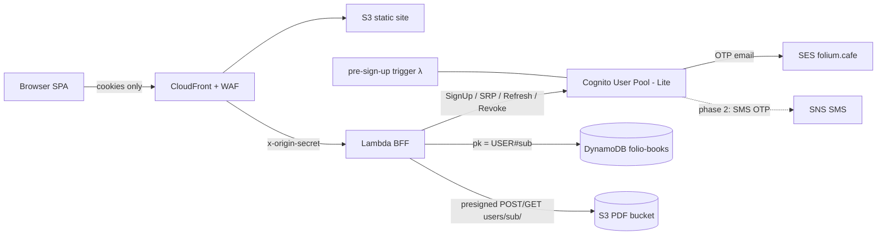

# AWS Architecture Plan: Folium Multi-User with Cognito

**Date:** 2026-06-12 · **Status:** Proposed · **Region:** us-east-1

## Summary

Replace Folium's single shared password with Amazon Cognito user pools (Lite tier),
turning the private reading room into a multi-tenant app with open self-signup.
Users pick a unique, DNS-label-safe handle (4–12 chars), verify their email with an
OTP code (phone optional, verifiable later), and stay signed in for 90 days. The
existing BFF shape is preserved: the Lambda keeps owning HttpOnly cookies, the SPA
never touches tokens. Data isolation moves from the constant `pk = "lib"` to
`USER#<cognito sub>` in DynamoDB and `users/<sub>/pdfs/` in S3.

## Discovery Summary

| Decision | Choice | Consequence |
|---|---|---|
| Signup model | **Open self-signup** | WAF/rate limiting + per-user quotas become mandatory |
| Verification | **Email OTP required; phone optional** | SES production access needed; SNS SMS deferred to phase 2 |
| Session length | **90 days** | Cognito refresh token validity = 90d; access token 30 min |
| Username purpose | **Future-proofing only** | DNS-label rules + reserved-name blocklist now; no public pages yet |

Existing stack (unchanged shape): CloudFront → S3 static SPA + Lambda Function URL
(origin-secret gated) → DynamoDB + private PDF bucket with presigned URLs. Terraform
in `infra/`, GitHub Actions OIDC deploys. `name_prefix = "folio"` is kept on purpose.

## Architecture

### Services

| Service | Purpose | Configuration | Monthly Est. |
|---|---|---|---|
| Cognito user pool | Identity, signup, OTP verification | **Lite tier** (`user_pool_tier = "LITE"`), username = handle, `alias_attributes = ["email"]`, `auto_verified_attributes = ["email"]`, password min 12, optional TOTP MFA, `prevent_user_existence_errors = ENABLED`, token revocation on; access/ID 30 min, refresh **90 days** | $0 (≤10k MAU free; then $0.0055/MAU) |
| Cognito pre-sign-up Lambda trigger | Enforce handle policy | Regex `^[a-z0-9][a-z0-9-]{2,10}[a-z0-9]$` (4–12, DNS-label-safe) + reserved-names blocklist (see appendix), lowercase-normalized | ~$0 |
| SES | OTP/verification email | Domain identity `folium.cafe`, DKIM + SPF/DMARC records in Route53, Cognito `email_configuration` → DEVELOPER mode with SES ARN. **Production access request required before launch** | <$1 ($0.10/1k emails) |
| Lambda-side rate limiting | Open-signup abuse control (WAF deferred — cost decision) | Per-IP sliding-window throttle in the BFF for `/api/signup`, `/api/login`, `/api/forgot` (counters in the existing DynamoDB table with TTL); email-verification gate before any writes | ~$0 |
| Existing Lambda (BFF) | Auth broker + API | New routes: `/api/signup`, `/api/confirm`, `/api/login` (SRP → Cognito `InitiateAuth`), `/api/refresh` (transparent), `/api/forgot`, `/api/logout` (`RevokeToken`). Verifies access JWT per request via `aws-jwt-verify` pinned to `{userPoolId, tokenUse: "access", clientId}` | ~$0 |
| DynamoDB `folio-books` | Per-user library | Same table & keys; `pk` becomes `USER#<sub>` (sub from verified JWT only). Add explicit `server_side_encryption` block. New sparse item per user: `USER#<sub>` / `meta` for quota counters + `tokensValidAfter` revocation timestamp | ~$0–1 |
| S3 PDF bucket | Per-user PDFs | Keys → `users/<sub>/pdfs/<id>.pdf`; switch uploads to **presigned POST** with `content-length-range` (PUT cannot enforce size); explicit SSE config; per-user book-count quota in Lambda | usage-based |

Phase 2 (deferred): phone OTP via SNS SMS — requires exiting SNS sandbox,
toll-free/10DLC registration, **SNS monthly SMS spend cap + destination-country
allowlist set before enabling** (SMS-pumping defense).

### Auth flow (BFF — chosen over SPA-holds-tokens)

```
Signup:  SPA → POST /api/signup {username,email,password}
           Lambda re-validates handle → Cognito SignUp → pre-sign-up trigger checks policy
           → Cognito emails 6-digit OTP via SES → POST /api/confirm {code} → account active
Login:   SPA → POST /api/login → Lambda SRP auth vs Cognito
           → Set-Cookie: folio_at (access, 30 min) + folio_rt (refresh, 90 d)
           HttpOnly; Secure; SameSite=Strict; Path=/api  + CSRF double-submit cookie
Request: Lambda verifies folio_at JWT locally (JWKS cached, tokenUse+clientId pinned)
           → checks iat ≥ tokensValidAfter(sub) → scopes all data access by sub
           expired? → REFRESH_TOKEN_AUTH with folio_rt → re-Set-Cookie, retry once
Logout:  RevokeToken(folio_rt) + bump tokensValidAfter(sub) + clear cookies
```

Why BFF instead of Amplify/SDK-in-browser: tokens never reach JS (XSS-resistant),
the frontend keeps its current "cookie just works" model, and CloudFront config is
untouched. Trade-off: ~7 small auth routes in the Lambda and slightly more code than
dropping in `aws-amplify/auth`. The SPA-holds-tokens alternative is simpler to build
but exposes a 90-day refresh token to any future XSS — wrong trade for a document store.

### Diagram



## Security Review (Phase 3 — iac-reviewer findings, accepted into design)

**Blockers (all addressed above):**
1. *RevokeToken doesn't kill live access tokens* → 30-min access tokens + per-user `tokensValidAfter` timestamp checked on every request.
2. *SameSite=Lax ≠ CSRF defense* → `SameSite=Strict`, `Path=/api`, host-only cookies + double-submit CSRF token on all mutating routes.
3. *JWT verifier pinning* → `CognitoJwtVerifier.create({userPoolId, tokenUse:"access", clientId})`, fail closed; tests assert ID tokens and foreign-client tokens are rejected.
4. *No explicit encryption-at-rest* → add `aws_s3_bucket_server_side_encryption_configuration` + DynamoDB `server_side_encryption` blocks.

**Key warnings folded in:** `PreventUserExistenceErrors=ENABLED` + generic
login/forgot responses (enumeration); handle re-validated in BFF (trigger is not a
boundary — `AdminCreateUser` bypasses it); the reviewer rated WAF launch-mandatory
for open signup — **accepted risk**: launching with Lambda-side per-IP throttling
instead (cost decision, owner: Marco), WAF added at first abuse signal; SES
production access + SPF/DMARC are launch prerequisites; presigned
POST (not PUT) for size enforcement, ownership re-checked before every presign; Lambda
IAM gets only unauthenticated Cognito actions (`InitiateAuth`, `SignUp`,
`ConfirmSignUp`, `RespondToAuthChallenge`, `ForgotPassword`, `ConfirmForgotPassword`,
`ResendConfirmationCode`, `RevokeToken`) scoped to the pool ARN — **no `cognito-idp:Admin*`**;
retire `app_password`/`hmac_key` SSM params and their IAM grants entirely.

Unverified-by-docs items to confirm during implementation: exact Cognito
default-email daily cap, case-insensitivity behavior with `alias_attributes`,
Function-URL `AWS:SourceArn` invoke condition support.

## SCP Guardrails (org level, if/when an org exists)

Deny: unencrypted S3/DynamoDB/EBS creation · S3 public-access grants · disabling
the PDF bucket's public-access block · root access-key creation · require IMDSv2.
(Single-account today — track as backlog, not a launch gate.)

## Cost Estimate (incremental over current stack)

| Scenario | Monthly Estimate |
|---|---|
| Baseline (≤1k users) | **~$0–2** (Cognito free tier; SES <$1; DDB/Lambda ≈ $0) |
| 10k MAU | $2–10 (Cognito still in free tier; SES ~$1; storage grows with PDFs) |
| 50k MAU | ~$230 (Cognito $0.0055 × 40k over free tier ≈ $220 + SES) |

No new fixed costs at launch: WAF (~$8–12/mo) was cut by decision — Lambda-side
rate limiting covers signup/login abuse. Escalation trigger for adding WAF:
sustained bot signups surviving the per-IP throttle, or an SES bounce/complaint
spike. S3 storage is the real at-scale driver (user PDFs) — quotas cap it.

## Trade-offs & Decisions

- **Lite tier, not Essentials** — we need OTP *verification* (in Lite), not
  passwordless email-OTP *login* or threat protection. Set `user_pool_tier = "LITE"`
  explicitly (new pools default to Essentials at 2.7× the price).
- **Handle = Cognito username (immutable)** — uniqueness enforced natively by
  Cognito; trade-off: users can never rename. Alternative (opaque username +
  `preferred_username` alias) allows renames but weakens the future
  handle-as-subdomain guarantee. Chosen: immutable.
- **BFF cookies over browser tokens** — XSS-resistance and zero frontend token
  plumbing, at the cost of auth routes in the Lambda.
- **No hosted UI** — the "classy login gate" stays; Cognito is invisible to users.
- **No WAF at launch (decided 2026-06-12)** — keep fixed costs at ~$0; Lambda-side
  per-IP throttling is the abuse control. Revisit on first abuse signal.
- **Lock-in:** Cognito user records (password hashes are not exportable). Accepted —
  migration out would force a password-reset campaign.

## Risks & Mitigations

| Risk | Mitigation |
|---|---|
| SES production access denied/delayed | Apply early with concrete use-case text; fallback: invite-only launch under sandbox with verified recipients |
| OTP mail lands in spam → signups stall | DKIM + SPF + DMARC before launch; monitor SES bounce/complaint metrics |
| Migration corrupts the existing library | Create owner account first → capture sub → idempotent copy-verify-delete script; DynamoDB on-demand backup + keep old `pdfs/*` until verified |
| Signup bot floods | Per-IP throttles in BFF + email-verification gate before any writes; WAF held in reserve (accepted risk — see escalation trigger in Cost Estimate) |
| SMS pumping (phase 2) | SNS spend cap + country allowlist *before* enabling phone OTP — hard gate |
| Cookie header bloat | Only access+refresh+CSRF cookies (no ID token); ~3 KB total, under limits |

## Next Steps

1. **Terraform**: `infra/cognito.tf` (pool, Lite tier, client, trigger), `infra/ses.tf`
   (identity, DKIM/SPF/DMARC Route53 records), encryption blocks in `data_stores.tf`;
   request SES production access (manual, do first — longest lead time).
2. **Backend**: auth routes + `aws-jwt-verify` middleware + sub-scoped `repo.mjs`
   (presigned POST, quotas, ownership checks). TDD per repo convention.
3. **Frontend**: signup/confirm/login screens on the existing login-gate aesthetic.
4. **Migration**: one-off script (owner account → rewrite `lib` items → copy PDFs).
5. **Retire**: `ssm.tf` params, `auth.mjs` HMAC code, shared-password login path.

Decisions closed 2026-06-12: reserved-names blocklist adopted (appendix below);
WAF deferred to first abuse signal.

Phase 2 backlog: phone OTP (SNS sandbox exit, 10DLC/toll-free registration, spend cap),
SMS MFA, public profile pages (`folium.cafe/@handle`), WAF on abuse signal.

## Appendix: Reserved Usernames

Checked case-insensitively in the pre-sign-up trigger *and* re-checked in the BFF
signup route. The 4-char minimum already blocks short infra names (`www` is listed
anyway for clarity if the minimum ever drops). Substring matching is intentionally
NOT used — exact match only, so `bookworm` stays available despite `books`.

```
admin administrator root system security abuse postmaster webmaster hostmaster
noreply no-reply mailer-daemon support help info contact billing payments legal
privacy terms about team staff official moderator
www mail smtp imap pop3 ftp sftp ns1 ns2 dns mx cdn static assets img images
media files api app web dev test testing staging prod production demo beta
status docs blog news
login logout signin signout signup register auth oauth account accounts
settings profile profiles user users username guest anonymous nobody
folium cafe foliumcafe library shelf shelves book books reader read reading
folio leaf
```

Open for additions before implementation (e.g. personal names, future feature
words). Adding to the list later never breaks existing users — it only blocks
new registrations — so err on the side of starting lean.
